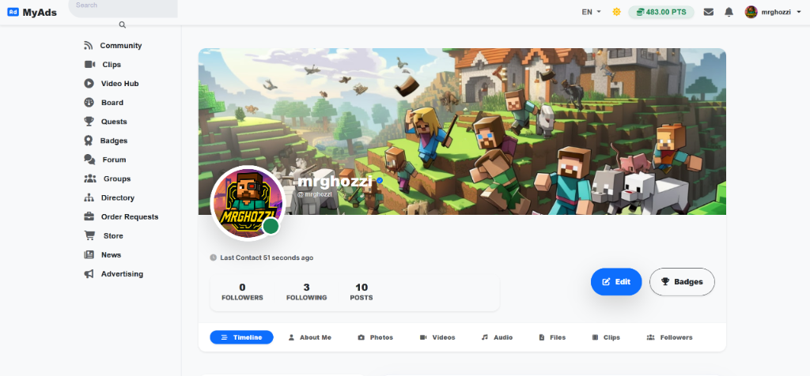
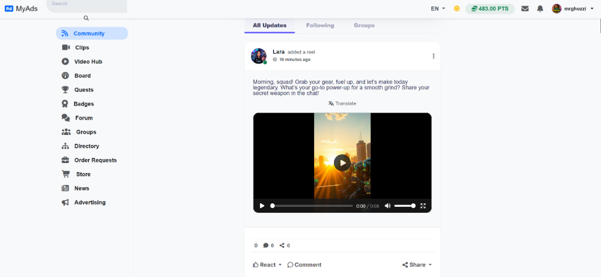
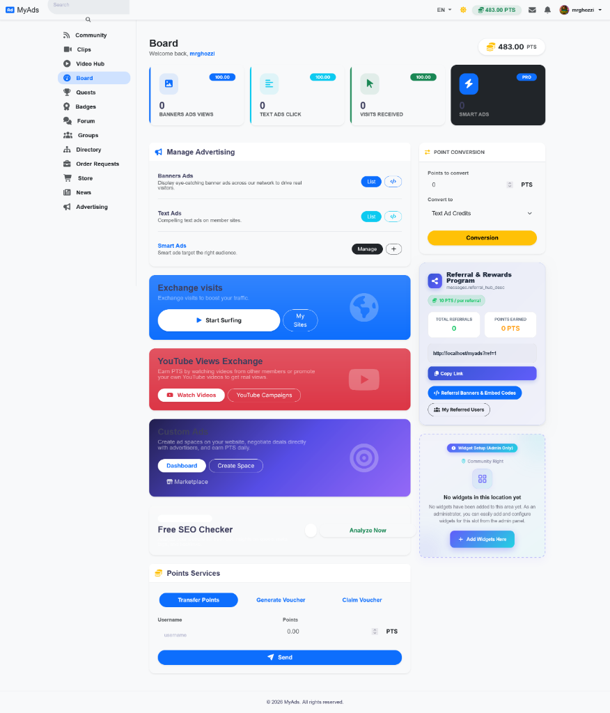
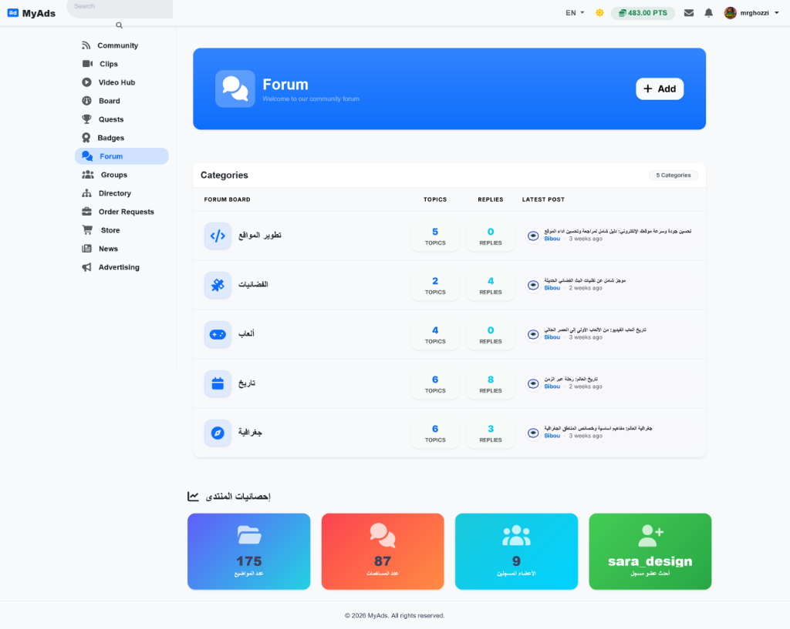
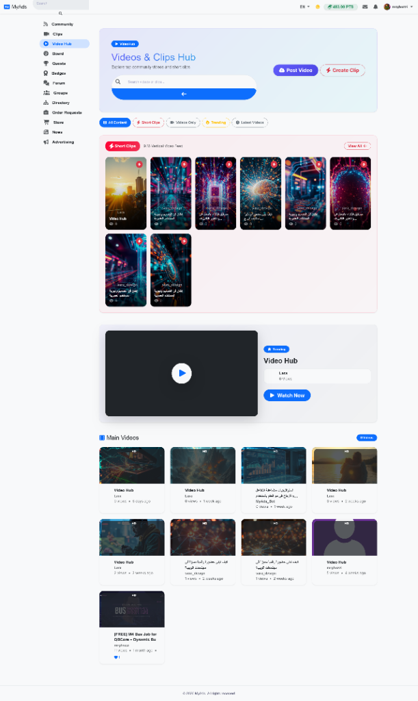

# Bootstrap Sample Theme Screenshots

Explore the modern, responsive interface and user experience of the Bootstrap Sample theme.

## 👤 Member Profile & Visual Identity
Comprehensive user profile with custom cover art, verified badges, live online presence indicator, follower statistics, and dedicated media tabs (Timeline, About Me, Photos, Videos, Audio, Files, Clips, and Followers).

## 🌐 Community Social Feed & Video Reels
Clean, card-based social activity stream with multi-channel filtering (All Updates, Following, Groups), multi-format video and reel players, instant translation, reactions, and sharing.

## 📊 Member Board & Advertising Hub
Centralized member dashboard featuring live PTS balance, banner/text/smart ad campaigns management, traffic visit exchange, YouTube views exchange, Custom Ads marketplace, Free SEO Checker, and PTS vouchers transfer.

## 💬 Community Forum Boards & Statistics
Structured discussion forum with modern categorized boards, topic and reply counters, latest activity tracking, and visual forum statistics counters.

## 🎬 Videos & Short Clips Hub
Rich multimedia entertainment hub featuring 9:16 vertical Short Clips, trending feature video players, 16:9 YouTube-style main video grid, and one-click video and clip submission tools.

