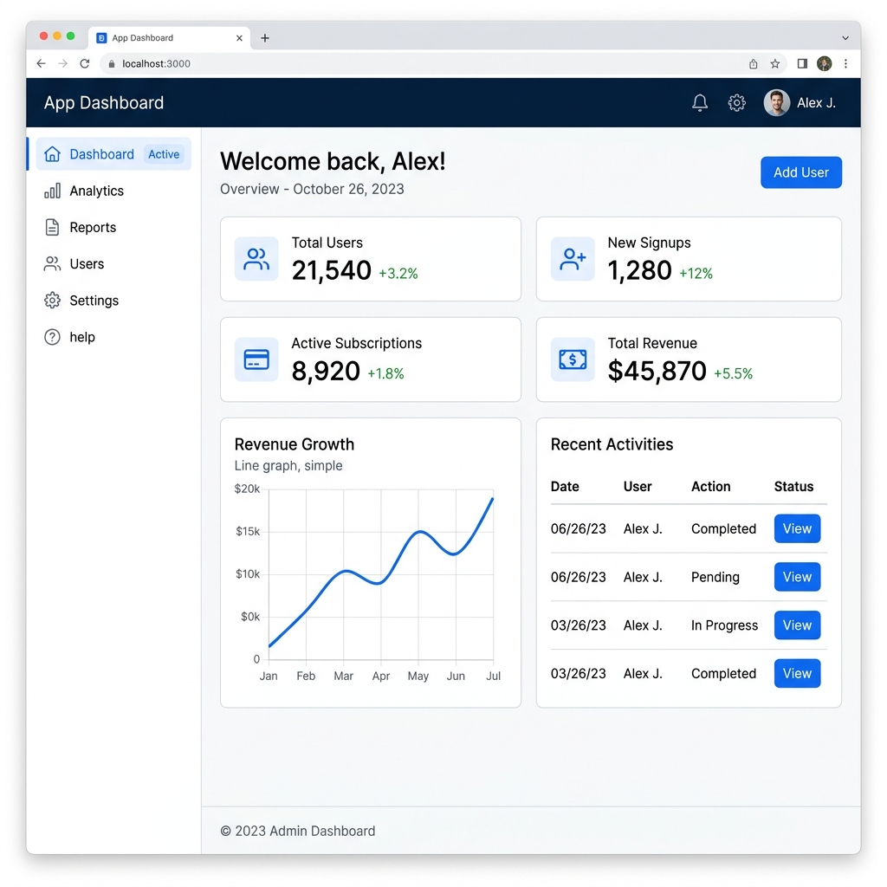

# Bootstrap Sample Theme Screenshots

Explore the modern, responsive interface and user experience of the Bootstrap Sample theme.

## 🌟 Main Feed & Modern Portal
A clean, card-based social feed and community exchange with quick navigation, responsive widgets, and multi-format post composer.

## 💬 Superdesign Private Messaging
An ultra-modern 2-column real-time messaging workspace featuring active conversation highlighted states, soft bubble threads, image previews, file chips, and an interactive emoji picker.

## 🎨 Live Theme Customizer & Real-Time Sync
Fine-tune design tokens (primary colors, border radius, fonts, and dark mode surface) with instant live preview and bidirectional synchronization.

## 👤 Profile Settings, Visual Identity & Badges Showcase
Intuitive visual identity editor with instant client-side photo previews, plus an interactive 6-badge showcase selector with real-time counters.

